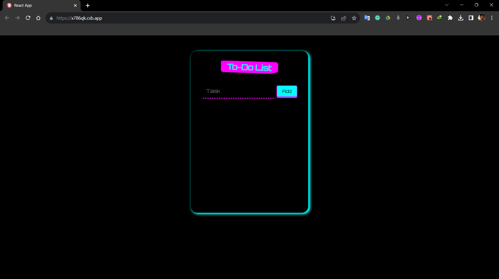
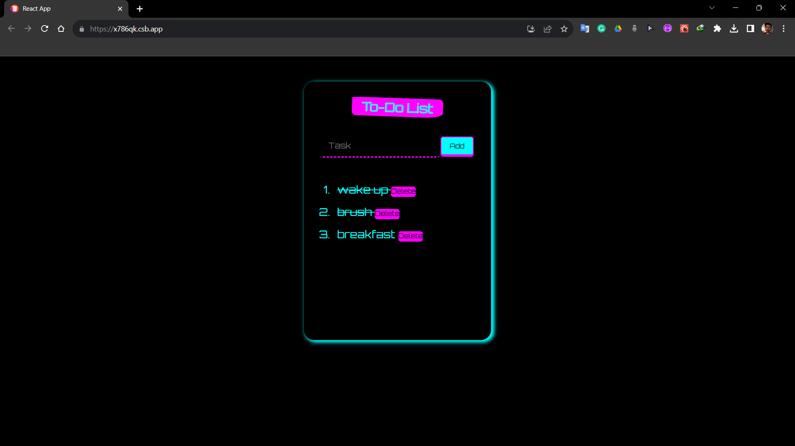
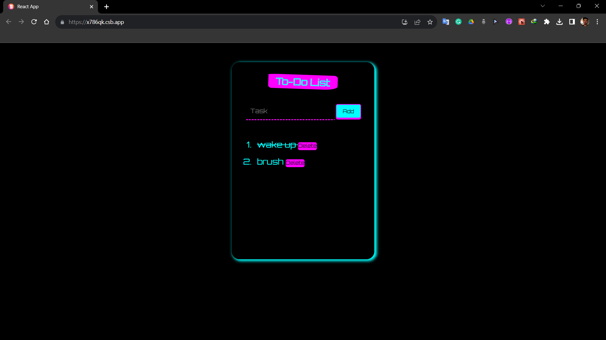

# Priority Pal
## Screenshots:




This is a simple TodoList web application built using HTML, CSS, JavaScript, and React.js. It allows you to manage your tasks efficiently by providing the following key features:

1. **Add Task**: Easily add new tasks to your list.
2. **Delete Task**: Remove tasks you no longer need.
3. **Mark Completed**: Indicate tasks as completed when you finish them.

## Demo

You can try out the live demo of this TodoList app [here](https://x786qk.csb.app/).

## Table of Contents

- [Installation](#installation)
- [Usage](#usage)
- [Development](#development)
- [Contributing](#contributing)

## Installation

To run this app locally, follow these steps:

1. Clone this repository to your local machine:

   ```bash
   git clone https://github.com/yourusername/todo-list-app.git

2. Navigate to the project directory:

   ```bash
   cd todo-list-app

3. Install the required dependencies:

   ```bash
   npm install

4. Start the development server:

   ```bash
   npm start

5. Open your browser and go to http://localhost:3000 to use the app.

## Usage

To add a task, simply type the task description in the input field and click the "Add Task" button.

To delete a task, click the "Delete" button next to the task you want to remove.

To mark a task as completed, click the checkbox next to the task.

## Development

If you want to contribute to the development of this project, here are some steps to get started:

1. Fork the repository to your GitHub account.
2. Clone the forked repository to your local machine.
3. Create a new branch for your feature or bug fix: git checkout -b feature/new-feature.
4. Make your changes and commit them: git commit -m "Add new feature".
5. Push your changes to your fork on GitHub: git push origin feature/new-feature.
6. Create a pull request to the original repository.

Please make sure to follow the Contributing Guidelines when submitting contributions.

Happy task management with our TodoList app! If you have any questions or suggestions, feel free to open an issue or contact us at quicksilver92571331@gmail.com.


Remember to replace the placeholders with actual links, paths, and information relevant to your project. You may also want to include screenshots or GIFs to showcase your app in the README.

   
